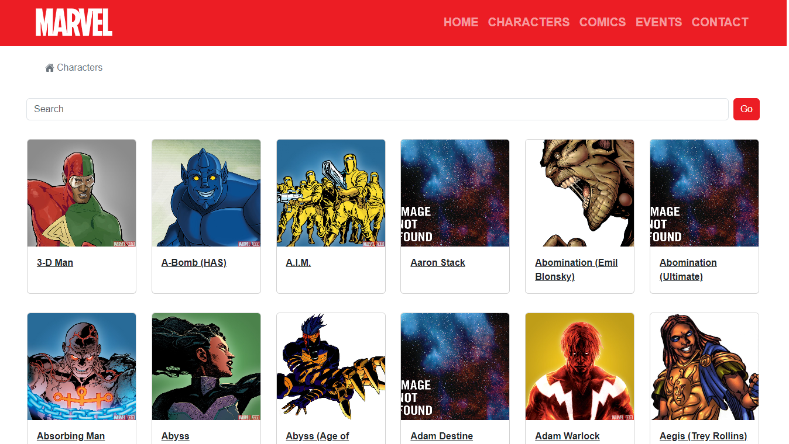

<h1 align="center">
  💻<br>Landing Page - Marvel API
</h1>



<h4 align="center"><a href="https://marvel-the-api.netlify.app/">Click to visit the project</a></h4>

---

## 💼 Technologies used

To develop this website I used the following technologies:

- HTML;
- Bootstrap;
- Vue;

---

## Setup

Make sure to install the dependencies:

```bash
# npm
npm install
```

## Development Server

Start the development server on `http://localhost:3000`:

```bash
# npm
npm run dev
```
---

<h2>Author</h2>

<table>
  <tr>    
    <td align="center">
      <a href="https://github.com/Isaacvf-dev">
        <br>
        <sub>
          <b>Isaac Vieira</b>
        </sub>
      </a>
    </td>
  </tr>
</table>
